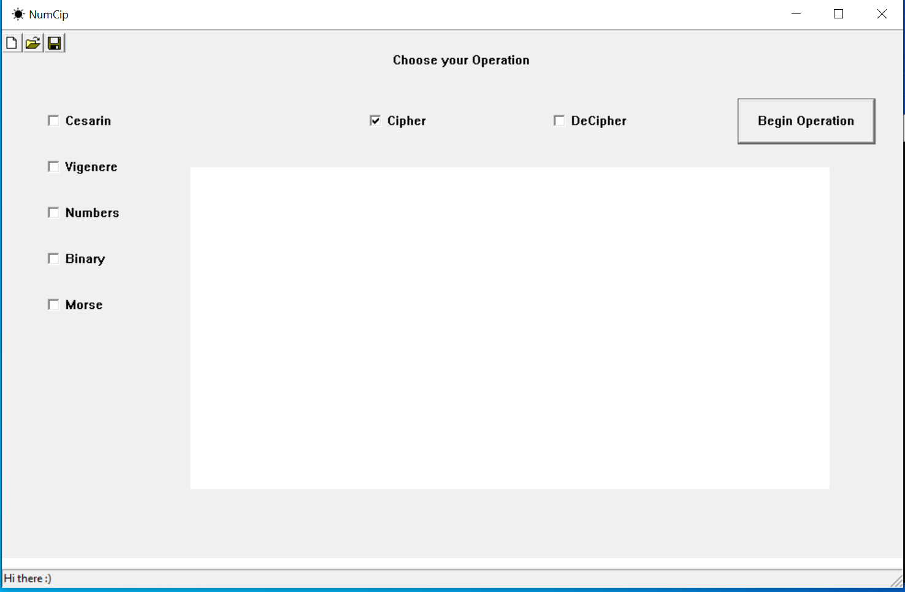

# CipherProject

This project contains a program that is capable to encrypt and decrypt the data. It has three ciphers in particular: the Caesar, the Binary (based on xnor) and the Morse code.

Open the .cpp file directly, it contains the full program description in there.

NB! In order to simplify the process of using the ciphers, the files were conencted to each other. In case of running the program - run the main.pp file only. 

In fact, these ciphers initially were a part of a bigger program with some simple user interface that was developed in cooperation with a few people. 
The final project had the following graphic user interface where user could choose and change the cipher as well as the input field for the text:

